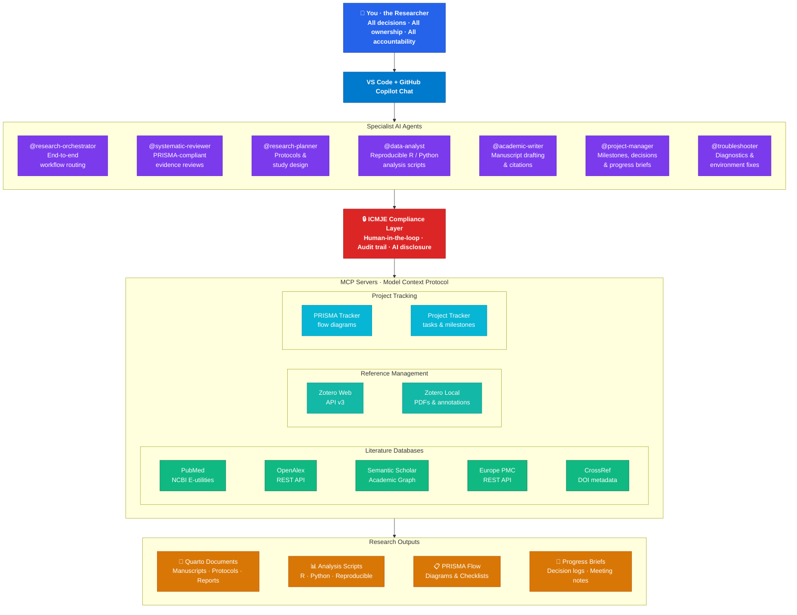

# Research Workflow Assistant

An open-source, modular AI research assistant that runs inside **[VS Code](https://code.visualstudio.com/) + [GitHub Copilot](https://github.com/features/copilot)**. It connects to academic databases via MCP (Model Context Protocol) servers and encodes research best practices through custom Copilot agents. Built for reproducibility, ICMJE compliance, and human-centered research.

> **Model note:** This project was developed and tested using **Claude Opus 4.6** and **GPT-5.3-Codex** in GitHub Copilot agent mode. You can switch between models depending on task type and preference. Other models available in Copilot ([model comparison](https://docs.github.com/en/copilot/reference/ai-models/model-comparison)) may also work, but behavior can vary by agent workflow, so validate critical outputs after switching.

> **First time here?** Start with [docs/quick-start.md](docs/quick-start.md),
> or open Copilot Chat and type `@setup` for an interactive guided setup.
> If setup is complete and something is not working, use `@troubleshooter` for diagnostics and issue resolution.
> For the full walkthrough, see [docs/getting-started.md](docs/getting-started.md).

> **Important:** Before using non-setup agents, you must accept the user disclaimer once via `@setup`.

## Who Is This For?

Any researcher who wants AI-assisted support without surrendering intellectual ownership:

- **NGO and public sector researchers** managing evidence reviews or program evaluations
- **Government analysts** producing policy briefs backed by systematic evidence
- **Academic faculty and postdocs** running systematic reviews or multi-study projects
- **Independent researchers and consultants** needing structured, reproducible workflows
- **Research organizations** wanting standardized, auditable research processes

No PhD required. If you do research, this tool is for you.

## What It Does

| Capability | How |
|---|---|
| **Systematic literature reviews** | `@systematic-reviewer` agent guides PRISMA-compliant workflows: question refinement (PICO/PEO/SPIDER), search strategy development, database searching, screening, data extraction, risk of bias |
| **Academic database access** | MCP servers for PubMed, OpenAlex, Semantic Scholar, Europe PMC, CrossRef, Scopus (institutional) |
| **Reference management** | Zotero MCP server: search library, add items by DOI, tag, organize collections, export BibTeX |
| **Data analysis** | `@data-analyst` agent generates reproducible R or Python analysis scripts in Quarto documents |
| **Academic writing** | `@academic-writer` agent scaffolds IMRaD manuscripts, manages citations, enforces ICMJE AI disclosure |
| **Research planning** | `@research-planner` agent helps with protocols, ethics applications, study design, grant writing |
| **Project management** | `@project-manager` agent tracks phases, milestones, tasks, decisions; generates progress briefs for colleagues |
| **End-to-end orchestration** | `@research-orchestrator` routes workflows across specialist agents, tracks stage progression, and provides ready-to-run handoff prompts |
| **Troubleshooting and support** | `@troubleshooter` agent diagnoses environment and MCP issues, validates API keys, and provides practical how-to help for day-to-day RWA usage |
| **ICMJE compliance** | Built into every agent: human-in-the-loop mandate, audit trail, AI disclosure generation, authorship checklist |

## Architecture



> Also available as [SVG](docs/rwa-architecture.svg), [rendered HTML](docs/architecture-diagram.qmd) (`quarto render docs/architecture-diagram.qmd`), or [Mermaid source](docs/rwa-architecture.mmd).

## ICMJE Compliance: You Are the Author

This tool is designed around the [ICMJE authorship criteria](https://www.icmje.org/recommendations/browse/roles-and-responsibilities/defining-the-role-of-authors-and-contributors.html). AI cannot be an author. You must meet all four criteria:

1. **Substantial contributions** to conception, design, data acquisition, analysis, or interpretation
2. **Drafting or critically revising** the work for important intellectual content
3. **Final approval** of the version to be published
4. **Accountability** for all aspects of the work

The tool enforces this by:
- Requiring human decisions at every substantive step
- Tracking AI contributions in an audit trail (`ai-contributions-log.md`)
- Generating ICMJE-compliant AI disclosure statements for your manuscripts
- Refusing to finalize outputs without explicit human review

Per ICMJE Section II.A.4: AI use must be disclosed in acknowledgments (writing assistance) and methods (data analysis). This tool generates those disclosures for you.

Setup also captures a default author profile in [.rwa-user-config.yaml](.rwa-user-config.yaml), and new projects can store per-project `authors` metadata in [templates/project-config.yaml](templates/project-config.yaml) so future reports and manuscripts start with the correct author front matter.

When RWA itself is cited in a Methods or Acknowledgments section, use the `vanzyl2026rwa` BibTeX entry from [templates/rwa-citation.bib](templates/rwa-citation.bib).

## Disclaimer and Readiness Gate

RWA enforces a disclaimer/readiness gate before non-setup agent workflows.

- Source disclaimer text: [compliance/user-disclaimer.md](compliance/user-disclaimer.md)
- Acceptance state file: [.rwa-user-config.yaml](.rwa-user-config.yaml)
- Required value: `disclaimer_accepted: true` (boolean)

When accepted through `@setup`, `.rwa-user-config.yaml` should include values like:

```yaml
disclaimer_accepted: true
disclaimer_accepted_date: "YYYY-MM-DD"
setup_completed: true
setup_completed_date: "YYYY-MM-DD"
default_author:
  name: "Author Name"
  affiliation:
    name: "Organization"
```

If acceptance is missing or invalid, agents will return:

`Before using RWA, you need to review and accept the disclaimer. Run @setup to get started.`

If you see this message unexpectedly:

1. Confirm [.rwa-user-config.yaml](.rwa-user-config.yaml) exists at workspace root.
2. Confirm `disclaimer_accepted` is boolean `true` (not a quoted string).
3. Run `@setup` again to refresh config if needed.
4. Open a new Copilot Chat session after setup changes.

## Quick Start

<details>
<summary><strong>What setup includes (typical 20-30 minutes)</strong></summary>

- Stage 1: Verify Python and VS Code prerequisites
- Stage 2: Create `.venv` and install all MCP servers
- Stage 3: Configure `.env` API keys and `PROJECTS_ROOT`
- Stage 4: Run setup validation + MCP smoke check
- Stage 5: Confirm servers in VS Code
- Stage 6: Save a default author profile for future outputs
- Stage 7: Optionally start a first project with project-specific authorship metadata

</details>

> **Prefer a guided setup?** Open Copilot Chat and type `@setup`. It will
> walk you through every step interactively.

### Prerequisites

| Requirement | Notes |
|---|---|
| [VS Code](https://code.visualstudio.com/) 1.99+ with [GitHub Copilot](https://github.com/features/copilot) | Agent mode must be enabled |
| [Python 3.11+](https://www.python.org/) | Required — runs the MCP servers |
| [R 4.0+](https://www.r-project.org/) | Optional — for R-based analysis templates |
| [Quarto](https://quarto.org/) | Optional — for rendering document templates |
| [Zotero](https://www.zotero.org/) | Optional — for reference management |

### Step 1 — Clone and open the repo

```bash
git clone https://github.com/yourusername/research-workflow-assistant.git
cd research-workflow-assistant
code .
```

### Step 2 — Create a Python environment and install MCP servers

```bash
# Create and activate a virtual environment
python -m venv .venv
# Windows:
.venv\Scripts\activate
# macOS / Linux:
# source .venv/bin/activate

# Install all 9 MCP servers in development mode
pip install -e mcp-servers/pubmed-server \
            -e mcp-servers/openalex-server \
            -e mcp-servers/semantic-scholar-server \
            -e mcp-servers/europe-pmc-server \
            -e mcp-servers/crossref-server \
            -e mcp-servers/zotero-server \
            -e mcp-servers/zotero-local-server \
            -e mcp-servers/prisma-tracker \
            -e mcp-servers/project-tracker

# Install dev tools (linting, testing)
pip install -e ".[dev]"
```

### Step 3 — Configure API keys

```bash
# Copy the example env file
cp .env.example .env          # macOS / Linux
copy .env.example .env        # Windows
```

Open `.env` and add your credentials. At minimum:

| Key | Where to get it | Required? |
|---|---|---|
| `NCBI_API_KEY` | [NCBI account settings](https://www.ncbi.nlm.nih.gov/account/settings/) | Recommended |
| `OPENALEX_API_KEY` | [OpenAlex API key settings](https://openalex.org/settings/api-key) | Recommended |
| `ZOTERO_API_KEY` | [Zotero key settings](https://www.zotero.org/settings/keys) | If using Zotero |
| `ZOTERO_USER_ID` | Numeric ID shown at the top of the [Zotero keys page](https://www.zotero.org/settings/keys) (not your username) | If using Zotero |

Full details: [docs/api-setup-guide.md](docs/api-setup-guide.md)

`PROJECTS_ROOT` should normally remain `./my_projects` unless you explicitly want projects in another folder.

### Step 4 — Verify everything works

```bash
python scripts/validate_setup.py
```

Need JSON for automation?

```bash
python scripts/validate_setup.py --json
```

Or in VS Code: **Ctrl+Shift+P** → "MCP: List Servers" — all 9 servers should appear.

### Step 5 — Start using it

If you want one entry point that coordinates all phases, start with:

```
@research-orchestrator I am starting a systematic review. Orchestrate the full workflow and tell me exactly which agent prompt to run at each stage.
```

Or choose a specialist agent directly if you already know the stage.

Open Copilot Chat and try an agent:

```
@project-manager Initialize a new project called "my-first-review" in my_projects/my-first-review.
```

See [docs/getting-started.md](docs/getting-started.md) for the full guide, including project setup, multi-project workflows, and cross-workspace usage.

### Usage examples

```
@systematic-reviewer I want to conduct a systematic review on the effectiveness
of community health worker interventions for maternal mental health in low- and
middle-income countries.
```

```
@project-manager Initialize a new project for my systematic review. Target
completion is September 2026.
```

```
@data-analyst I have extracted data from 23 studies. Help me set up a
random-effects meta-analysis using the metafor package in R.
```

## Project Structure

```
research-workflow-assistant/
├── .github/
│   ├── copilot-instructions.md      # ICMJE + research integrity rules
│   └── agents/                      # Custom Copilot agents
├── .vscode/
│   ├── settings.json
│   └── mcp.json                     # MCP server configuration
├── mcp-servers/                     # MCP server implementations (Python)
│   ├── pubmed-server/
│   ├── openalex-server/
│   ├── semantic-scholar-server/
│   ├── europe-pmc-server/
│   ├── crossref-server/
│   ├── zotero-server/
│   ├── prisma-tracker/
│   └── project-tracker/
├── templates/                       # Quarto templates
│   ├── systematic-review/
│   ├── manuscript/
│   ├── report/
│   └── project-management/
├── analysis-templates/              # Reusable R/Python analysis templates
├── compliance/                      # ICMJE checklists, reporting standards
├── docs/                            # User documentation
└── tests/
```

## Database Access

| Database | API | Access | Auth |
|---|---|---|---|
| PubMed/MEDLINE | NCBI E-utilities | Free | API key (recommended) |
| OpenAlex | REST API | Free ($1/day budget) | API key (free) |
| Semantic Scholar | Academic Graph API | Free (rate limited) | API key (optional) |
| Europe PMC | REST API | Free | None |
| CrossRef | REST API | Free | Email (polite pool) |
| Zotero | Web API v3 | Free | API key |
| Scopus | Elsevier API | Institutional | API key |

Databases without APIs (CINAHL, PsycINFO, Web of Science, Google Scholar, Cochrane Library): the agents help you build database-specific queries, but you run the searches manually and import results.

## Reporting Standards

The tool supports multiple systematic review reporting standards (user selects):
- **PRISMA 2020** (systematic reviews with meta-analysis)
- **PRISMA-ScR** (scoping reviews)
- **MOOSE** (meta-analyses of observational studies)
- **Cochrane Handbook** methods

## Contributing

Contributions are welcome. See [CONTRIBUTING.md](CONTRIBUTING.md) for guidelines.

## License

[MIT License](LICENSE)

## How To Cite

If you use Research Workflow Assistant in a manuscript, report, protocol, or other cited output, cite it as:

van Zyl, A. (2026). Research Workflow Assistant [Computer software]. https://github.com/andre-inter-collab-llc/research-workflow-assistant

BibTeX:

```bibtex
@misc{vanzyl2026rwa,
  author = {van Zyl, Andre},
  title = {Research Workflow Assistant},
  year = {2026},
  url = {https://github.com/andre-inter-collab-llc/research-workflow-assistant},
  note = {GitHub repository}
}
```

You can also copy the canonical entry directly from [templates/rwa-citation.bib](templates/rwa-citation.bib) into your project's `references.bib`.

## Acknowledgments

- [ICMJE](https://www.icmje.org/) for authorship and AI disclosure guidelines
- [PRISMA](http://www.prisma-statement.org/) for systematic review reporting standards
- [MCP](https://modelcontextprotocol.io/) for the Model Context Protocol specification
- [Quarto](https://quarto.org/) for scientific publishing
- [Posit](https://posit.co/) for the R ecosystem
- Built with [GitHub Copilot](https://github.com/features/copilot) using [Claude Opus 4.6](https://docs.github.com/en/copilot/reference/ai-models/model-comparison) by Anthropic and GPT-5.3-Codex
