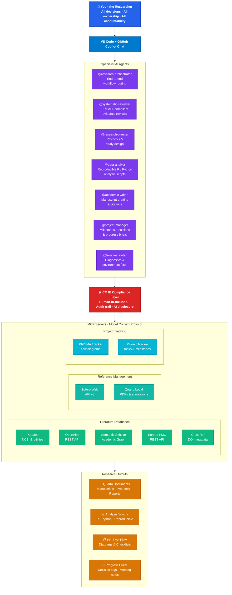

# Research Workflow Assistant — Architecture Diagram

<!-- Render with any Mermaid-compatible tool: GitHub markdown, Mermaid Live Editor, Quarto, etc. -->
<!-- For a PNG/SVG export, paste the fenced block into https://mermaid.live -->



## How to export a static image

1. Copy the fenced Mermaid block above.
2. Paste it into **[Mermaid Live Editor](https://mermaid.live)**.
3. Download as **PNG** or **SVG**.
4. Save to `docs/rwa-architecture.png` (or `.svg`).
5. Reference from the README:
   ```markdown
   
   ```
